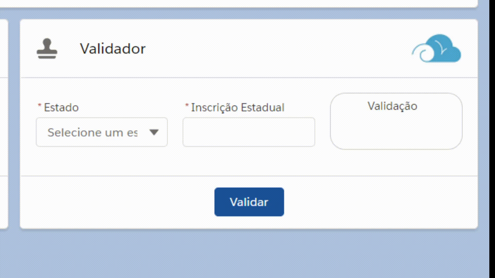
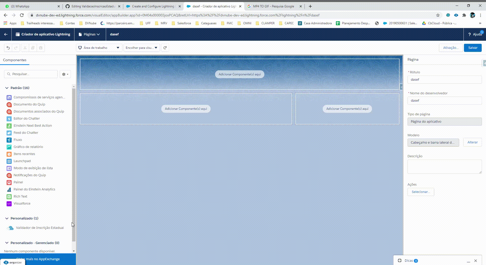
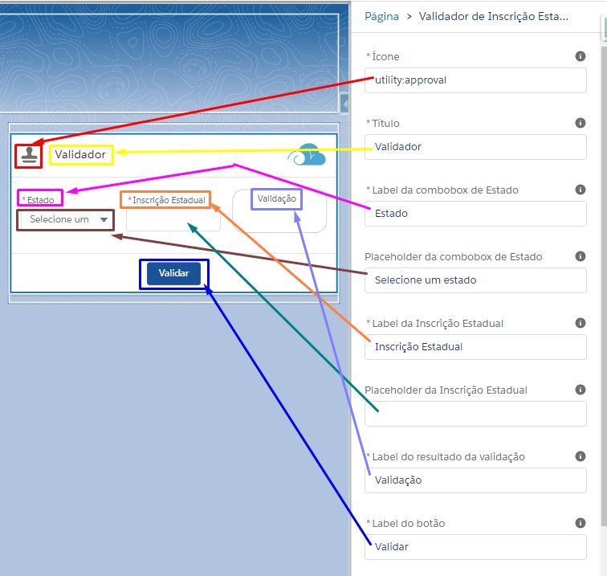
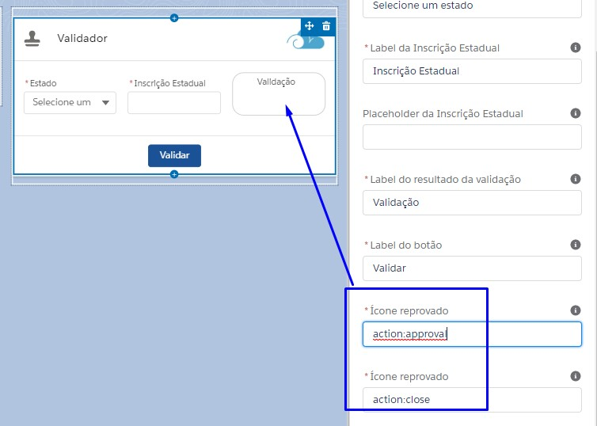
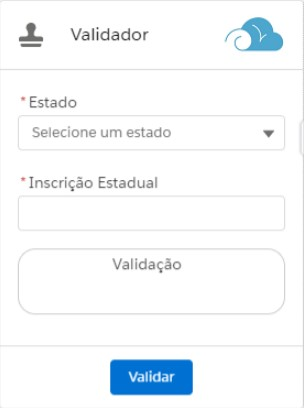

Validação de Inscrição Estadual
==

Instalação
==
1) Clique no botão relativo ao ambiente que irá instalá-lo (*Sandbox* ou *Produção*)
	- No exemplo, iremos instalá-lo em ***Developer Edition***, que é um ambiente de *Produção*.
2) Efetue login
3) Selecione para quem deseja instalar
	- Esse passo dependerá do seu uso em relação ao componente
	- Você pode selecionar a instalação somente para admins, para todos os usuários ou para perfis específicos
4) Clique em **Instalação**
5) Aguarde a Instalação e aparecerá uma tela para clicar em **Concluído**
6) Você será redirecionado para a tela de **Pacotes instalados**
Fim.
	

Sobre
==

- Inicialmente eu desenvolvi apenas o "cérebro" da validação de [Inscrição Estadual](http://www.sintegra.gov.br/insc_est.html) para um cliente que não queria depender de API de terceiros.
- Decidi aprimorá-lo e construir um [Lightning Web Component](https://trailhead.salesforce.com/pt-BR/content/learn/modules/lightning-web-components-basics) para facilitar seu uso, visto que o "motor" só era utilizado a partir de uma [Trigger](https://trailhead.salesforce.com/pt-BR/content/learn/modules/apex_triggers/apex_triggers_intro)
- A ideia em disponibilizá-lo publicamente com o código aberto é incentivar o estudo e o aprimoramento do componente.
- Sintam-se a vontade para utilizá-lo em seus ambientes, customizar da maneira que quiserem, corrigir bugs, etc.

Sobre o desenvolvimento
==

- Apliquei alguns padrões de [Heranças e polimorfismo](https://developer.salesforce.com/docs/atlas.en-us.apexcode.meta/apexcode/apex_classes_example.htm) nessa aplicação
- Classes:
  - 1 Enum
  - 1 Interface
  - 1 Utils
  - 1 Controller
  - 1 Virtual
  - 1 Factory
  - 27 que extendem a virtual e implementam a interface
  - 2 Test
- [Lightning Web Component](https://trailhead.salesforce.com/pt-BR/content/learn/modules/lightning-web-components-basics) que pode ser totalmente personalizado
- Custom labels
- Static resources

Configuração
==

Através do [Lightning App Builder](https://help.salesforce.com/articleView?id=lightning_app_builder_customize_lex_pages.htm&type=5), é possível customizar **quase** tudo, no que se diz respeito ao visual:

Mobile
==

Apesar de minha limitação com CSS, consegui deixá-lo pronto para mobile

