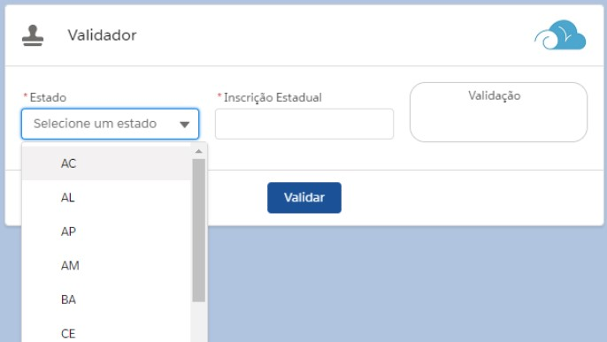

Validação de Inscrição Estadual
=================

Sobre o componente
============

Desenvolvi, inicialmente, apenas o "motor" de validação de [Inscrição Estadual](http://www.sintegra.gov.br/insc_est.html) para um cliente que não queria depender de API de terceiros.
Agora eu resolvi aprimorá-lo e construí um [LWC](https://trailhead.salesforce.com/pt-BR/content/learn/modules/lightning-web-components-basics) para facilitar seu uso, visto que no cliente era apenas chamado a partir de uma [Trigger](https://trailhead.salesforce.com/pt-BR/content/learn/modules/apex_triggers/apex_triggers_intro)

![tela]

Is derived from the **Dreamforce 2012** presentation on [Apex Enterprise Patterns](https://github.com/financialforcedev/df12-apex-enterprise-patterns) and progresses the patterns further with a more general ongoing home for them. It also adds some form of namespace qualification from the previous version. So that classes are grouped together more easily in the IDE's and packages. Below you can find comprehensive articles and videos on the use of these patterns. There is also a **working sample application** illustrating the patterns [here](https://github.com/apex-enterprise-patterns/fflib-apex-common-samplecode).

Application Enterprise Patterns on Force.com
============================================

Design patterns are an invaluable tool for developers and architects looking to build enterprise solutions. Here are presented some tried and tested enterprise application engineering patterns that have been used in other platforms and languages. We will discuss and illustrate how patterns such as Data Mapper, Service Layer, Unit of Work and of course Model View Controller can be applied to Force.com. Applying these patterns can help manage governed resources (such as DML) better, encourage better separation-of-concerns in your logic and enforce Force.com coding best practices.

Dreamforce Session and Slides
-----------------------------

- View slides for the **Dreamforce 2013** session [here](https://docs.google.com/file/d/0B6brfGow3cD8RVVYc1dCX2s0S1E/edit) 
- Video recording of the **Dreamforce 2013** session [here](http://www.youtube.com/watch?v=qlq46AEAlLI).
- Video recording of the **Advanced Apex Enterprise Dreamforce 2014** session [here](http://dreamforce.vidyard.com/watch/7QtP2628KmtXfmiwI-7B1w%20).
- View slides for the **Dreamforce 2015** session [here](http://www.slideshare.net/andyinthecloud/building-strong-foundations-apex-enterprise-patterns)

Documentation
-------------

- [Apex Sharing and applying to Apex Enterprise Patterns](http://andyinthecloud.com/2016/01/10/apex-sharing-and-applying-to-apex-enterprise-patterns/)
- [Tips for Migrating to Apex Enterprise Patterns](http://andyinthecloud.com/2015/09/30/tips-for-migrating-to-apex-enterprise-patterns/)
- [Great Contributions to Apex Enterprise Patterns](http://andyinthecloud.com/2015/07/25/great-contributions-to-apex-enterprise-patterns/)
- [Unit Testing, Apex Enterprise Patterns and ApexMocks – Part 1](http://andyinthecloud.com/2015/03/22/unit-testing-with-apex-enterprise-patterns-and-apexmocks-part-1/)
- [Unit Testing, Apex Enterprise Patterns and ApexMocks – Part 2](http://andyinthecloud.com/2015/03/29/unit-testing-apex-enterprise-patterns-and-apexmocks-part-2/)
- [Apex Enterprise Patterns - Separation of Concerns](http://wiki.developerforce.com/page/Apex_Enterprise_Patterns_-_Separation_of_Concerns)
- [Apex Enterprise Patterns - Service Layer](http://wiki.developerforce.com/page/Apex_Enterprise_Patterns_-_Service_Layer)
- [Apex Enterprise Patterns - Domain Layer](http://wiki.developerforce.com/page/Apex_Enterprise_Patterns_-_Domain_Layer)
- [Apex Enterprise Patterns - Selector Layer](https://github.com/financialforcedev/df12-apex-enterprise-patterns#data-mapper-selector)

**Other Related Blogs**

- [Preview of Advanced Apex Patterns Session (Application Factory and ApexMocks Features)](http://andyinthecloud.com/2014/08/26/preview-of-advanced-apex-enterprise-patterns-session/)
- [Unit Testing with the Domain Layer](http://andyinthecloud.com/2014/03/23/unit-testing-with-the-domain-layer/)
- [MavensMate Templates](http://andyinthecloud.com/2014/05/23/mavensmate-templates-and-apex-enterprise-patterns/)
- [FinancialForce Apex Common Updates](http://andyinthecloud.com/2014/06/28/financialforce-apex-common-updates/)

